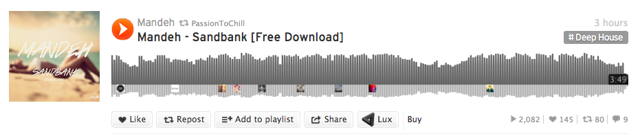

Download the Un-Downloadable
=========================================


This is a lightweight utility that allows you to inject a download button into web pages that Ritashugisha's [Luxinate](https://github.com/Ritashugisha/Luxinate) (backed by youtubedl) is capable of downloading audio from (e.g. youtube, soundcloud, bandcamp...).

[Luxinate](http://www.alfredforum.com/topic/3238-luxinate-download-video-and-audio-from-youtube-and-soundcloud/) is an awesome plugin for [Alfred 2](http://www.alfredapp.com/) that allows you to download Audio and Video (using youtube-dl) from a variety of sites, by simply providing a link to the page.

This utility extends Luxinate's capabilities into the browser with two parts:

- a simple web-api hosted locally to call Luxinate and begin song downloads
- a set of scripts to inject into pages that insert download buttons which call the web-api


**WARNING:** This is massively insecure, hacky, and overcomplicated, proceed at your own risk.  The same thing can be accomplished with many simpler chrome extensions, or by simply using youtube-dl directly.  I chose the hard way because I like Lux's interface and interaction with Alfred.

----

#Quickstart
This assumes that you're already comfortable with the command line, and that you are already running a webserver with php enabled on your mac.


```bash
git clone https://github.com/pirate/inject-luxinate
ln -s inject-luxinate /Library/WebServer/Documents/lux

nano inject-luxinate/luxinate/_config.xml
# change this line to your actual preffered download directory, then save and close
<download_dir default="/Users/nick/Downloads/">/Users/nick/Desktop/</download_dir>

sudo visudo
# insert the following line at the bottom (with the correct path), then save and close
_www    ALL=NOPASSWD: /path/to/inject-luxinate/download.py
```

That will allow you to call Luxinate using a URL from your browser.  After doing this step, opening [http://localhost/lux/lux.php?url=(...)](http://localhost/lux/lux.php?url=https://soundcloud.com/c-m-b-3/my-nyan-cat-dubstep-remix) should begin to download the Nyan Cat song to the download_dir location set in `luxinate/_config.xml`.
  
Now for part two, getting the download buttons injected:

1. Install the Chrome extension [Injector](http://neocotic.com/injector/) in order to inject css and js into pages (there are many equivalents for Firefox, Safari, and other browsers).
2. Go to the Injector settings page by clicking on the syringe icon by the address bar.
3. Add three new entries as follows:

>
1. **domain:** soundcloud.com  
*type:* CSS  
*content:* copy paste in everything from inject-lux-soundcloud.css  

>
2. **domain:** soundcloud.com  
*type:* JS   
*content:* copy paste in everything from inject-lux-soundcloud.js

>
3. **domain:** youtube.com  
*type:* JS   
*content:* copy paste in everything from inject-lux-youtube.js

You should now be able to visit your [Soundcloud Stream](http://soundcloud.com/stream) and see little triangle icons labelled "∆ Lux" next to every song.  Clicking on that icon will download the song. Give it a shot!



For [Youtube](https://www.youtube.com/watch?v=QH2-TGUlwu4) you can find the "∆" Luxinate button next to the thumbs-up and thumbs-down under the video.


